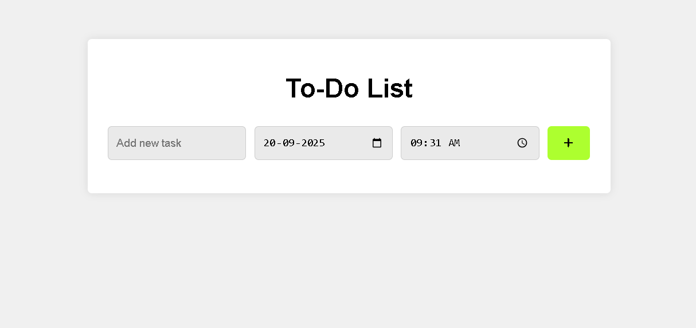
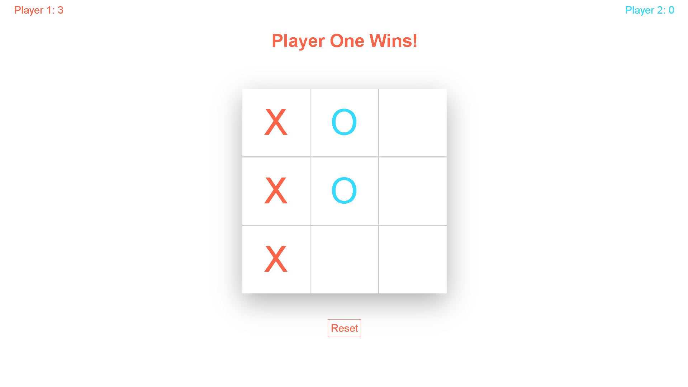
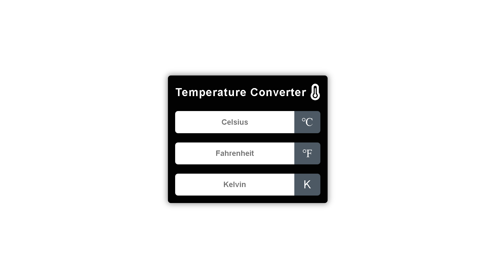
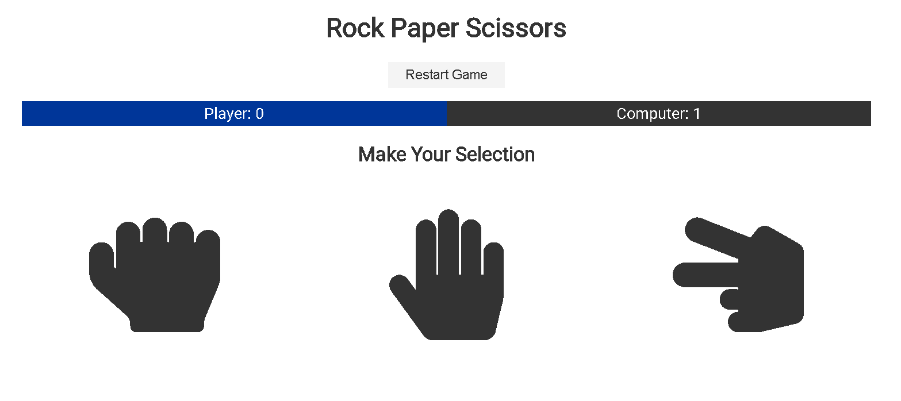
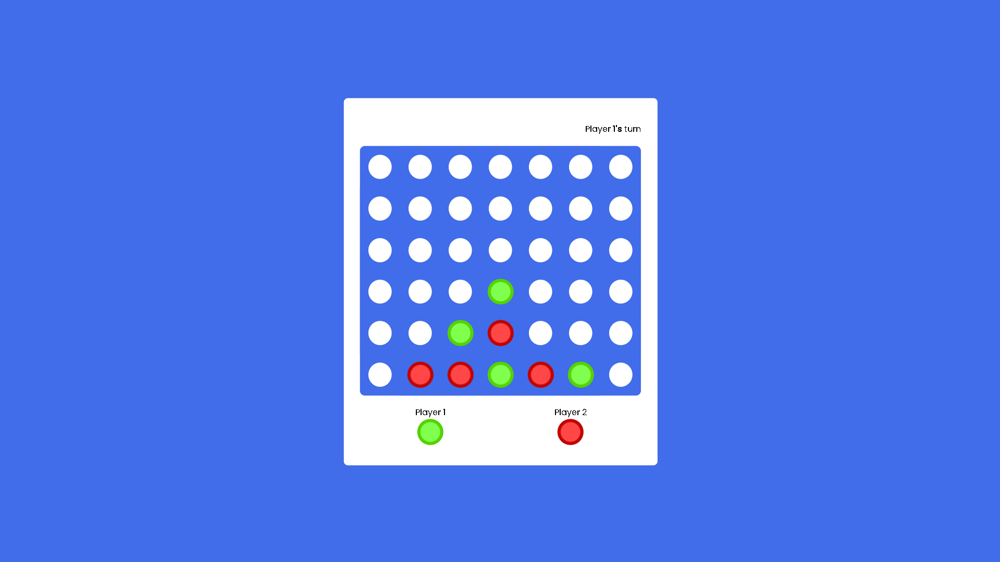
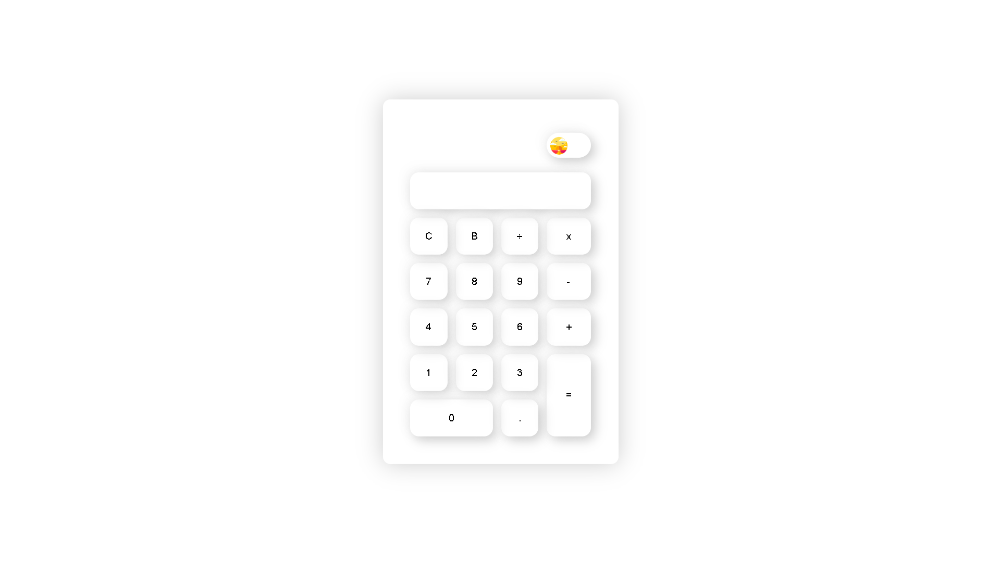

# LEARNING_HTML_CSS_JS

A collection of small interactive web projects using **HTML, CSS, and JavaScript**.

---

## Projects

### 1. Todo List
- Manage tasks with add, edit, delete functionality.
- Features task completion tracking.


### 2. Tic Tac Toe
- Play the classic Tic Tac Toe game.
- Two-player mode with score tracking.


### 3. Temperature Converter
- Convert between Celsius, Fahrenheit, and Kelvin.
- Interactive UI with instant updates.


### 4. Rock Paper Scissors
- Play against the computer.
- Displays winner in a modal with current score.


### 5. Password Generator
- Generate random secure passwords.
- Options to include uppercase, lowercase, numbers, and symbols.

### 6. Memory Game
- Match pairs of cards.
- Tracks number of clicks and matches.

### 7. Connect Four
- Classic Connect Four game.
- Two-player mode with win detection.


### 8. Calculator
- Basic calculator with a **dark mode toggle**.
- Simple and responsive design.


---

## Installation

Clone the repository:

```bash
git clone https://github.com/x-darkvanilla-x/LEARNING_HTML_CSS_JS.git
